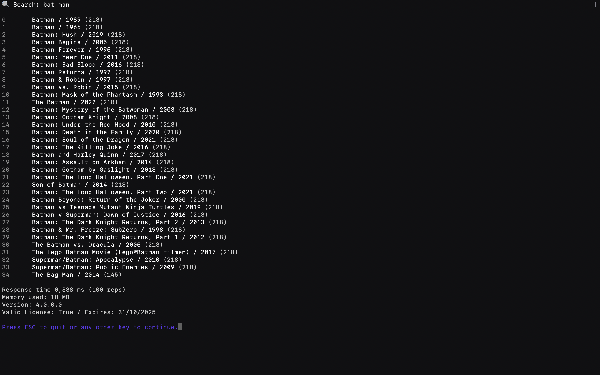

# A C# console app for Indx Search System version 4.0 with Core mode

This is a console app to load and search with [Indx](https://indx.co) as a linked class library

The app uses a dataset of TMDBs top 10.000 movie titles. It uses a minimal approach to load and go with a set of strings.



**Docs can be found on [docs.indx.co](https://docs.indx.co/apis)**

This app downloads an unlicensed version of IndxSearchLib from [nuget.org](https://www.nuget.org/packages/IndxSearchLib). To register as a developer and extend your license [fill out this form](https://lfut1rkw3es.typeform.com/to/jiN4Z82I)


## Requirements

- .NET 9, [download on dotnet.microsoft.com](https://dotnet.microsoft.com/en-us/download/dotnet/9.0)
- (optional) Extended developer access
    - [Request access here](https://lfut1rkw3es.typeform.com/to/jiN4Z82I)
    - After registering and receiving an indx.license file, place this in your project root folder.


## Run the app

```bash
dotnet run
```

Open terminal to enter search text.